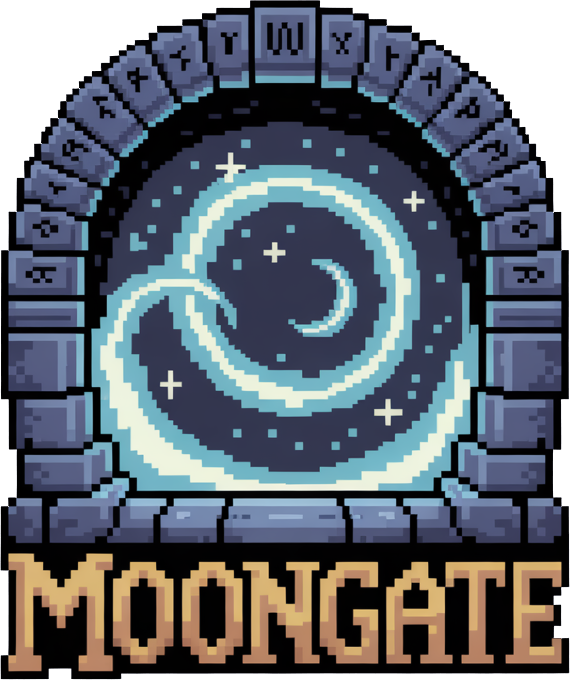

# Moongate Server

<p align="center">
  
  
  
  
  
</p>

```
                                                   __
 /'\_/`\                                          /\ \__
/\      \    ___     ___     ___      __      __  \ \ ,_\    __
\ \ \__\ \  / __`\  / __`\ /' _ `\  /'_ `\  /'__`\ \ \ \/  /'__`\
 \ \ \_/\ \/\ \L\ \/\ \L\ \/\ \/\ \/\ \L\ \/\ \L\.\_\ \ \_/\  __/
  \ \_\\ \_\ \____/\ \____/\ \_\ \_\ \____ \ \__/.\_\\ \__\ \____\
   \/_/ \/_/\/___/  \/___/  \/_/\/_/\/___L\ \/__/\/_/ \/__/\/____/
                                      /\____/
                                      \_/__/

              ++ New generation of Ultima Online server ++
  !! Please support me on Patreon: https://www.patreon.com/MoongateServer  !!
         Source code: https://github.com/moongate-community/moongate
```

## Overview

Moongate is a cutting-edge, ultra-high-performance Ultima Online server emulator built with .NET 9 and AOT (Ahead-of-Time)
compilation. Designed specifically for the passionate UO community that still cherishes this legendary MMORPG, Moongate
delivers exceptional performance and unprecedented customization capabilities through modern architecture and a powerful
JavaScript scripting engine.

Our mission is simple: create the **most performant and customizable UO server** ever built, giving dedicated players and
server administrators the tools they deserve.

## Vision & Philosophy

While Ultima Online may have a smaller player base today, those who still play deserve nothing less than perfection. Moongate
is built on these core principles:

- **Performance Above All** - Leveraging .NET 9 AOT for maximum speed and efficiency
- **JavaScript-Powered Customization** - Making server modification accessible to everyone
- **Modern Architecture** - Clean, maintainable code built for the future
- **Community-First** - Empowering server owners to create unique experiences
- **Legacy Respect** - Honoring classic UO while enhancing it with modern technology

## Key Features

### 🚀 Extreme Performance

- **AOT Compilation** - Faster startup, lower memory usage, predictable performance
- **Zero-Allocation Paths** - Critical code optimized to avoid garbage collection pressure
- **Asynchronous I/O** - High-throughput network operations with minimal overhead
- **Priority-Based Event Loop** - Intelligent task scheduling inspired by classic emulators
- **Memory Pool Management** - Efficient buffer reuse and memory management

### 🔧 Advanced Architecture

- **Modular Service Design** - Clean separation of concerns with dependency injection
- **Event-Driven System** - Comprehensive event bus for loosely coupled components
- **Pluggable Middleware** - Extensible packet processing pipeline
- **Configuration Management** - Flexible JSON-based configuration system
- **Comprehensive Logging** - Structured logging with Serilog including packet tracing

### 🛠️ JavaScript Scripting Engine

- **Jint Engine** - Full-featured JavaScript runtime with .NET interop
- **Hot-Reload Support** - Modify game logic without server restarts
- **TypeScript Definitions** - Auto-generated type definitions for development
- **Module System** - Organized script architecture with module support
- **Rich API** - Extensive scripting interface for all game systems

## Prerequisites

- [.NET 9 SDK](https://dotnet.microsoft.com/download/dotnet/9.0)
- Ultima Online Classic Client **version 7.x only** (officially supported)
- 4GB RAM minimum (8GB recommended)
- Visual Studio 2022 or JetBrains Rider for development

## Quick Start

### 🚀 Installation

1. **Clone the repository**
   ```bash
   git clone https://github.com/moongate-community/moongate.git
   cd moongate
   ```

2. **Build the solution**
   ```bash
   dotnet restore
   dotnet build
   ```

3. **Configure the server**
   ```bash
   # Copy example configuration
   cp config/server.example.json config/server.json

   # Edit configuration to set your UO client path
   nano config/server.json
   ```

4. **Run in development mode**
   ```bash
   dotnet run --project src/Moongate.Server
   ```

### ⚡ AOT Production Build

For maximum performance in production:

```bash
# Build with AOT compilation
./scripts/run_aot.sh

# Or manually:
dotnet publish -r linux-x64 -o dist -p:PublishAot=true -c Release src/Moongate.Server
./dist/Moongate.Server
```

### 🐳 Docker Deployment

```bash
# Build the Docker image
docker build -t moongate-server .

# Run with volume mapping for config and scripts
docker run -d \
  -p 2593:2593 \
  -v ./config:/app/config \
  -v ./scripts:/app/scripts \
  moongate-server
```

## Configuration

Moongate uses a comprehensive JSON configuration system:

```json
{
  "Network": {
    "Port": 2593,
    "MaxConnections": 1000,
    "LogPackets": false
  },
  "UltimaOnlineDirectory": "/path/to/uo/client",
  "Services": {
    "EventLoop": {
      "TickIntervalMs": 25
    },
    "ScriptEngine": {
      "EnableHotReload": true,
      "ScriptDirectory": "./scripts",
      "ScriptNameConversion": "CamelCase"
    },
    "Diagnostics": {
      "MetricsIntervalInSeconds": 60,
      "PidFileName": "moongate.pid"
    }
  },
  "Logging": {
    "MinimumLevel": "Information",
    "PacketLogging": false
  }
}
```

## JavaScript Scripting

### 🎯 Powerful Scripting Engine

Moongate features a sophisticated JavaScript scripting system that makes customization accessible:

```javascript
// Auto-generated TypeScript definitions provide full intellisense
/// <reference path="index.d.ts" />

// Example: Custom spell implementation (future implementation)
class Fireball {
  constructor() {
    this.manaCost = 15;
    this.requiredSkill = 40;
  }

  cast(caster, target) {
    if (!this.checkMana(caster)) {
      logger.warn(`${caster.name} lacks mana for Fireball`);
      return false;
    }

    const damage = this.calculateDamage(caster);
    target.takeDamage(damage);

    logger.info(`${caster.name} cast Fireball on ${target.name} for ${damage} damage`);
    return true;
  }

  calculateDamage(caster) {
    const magery = caster.skills.magery;
    return Math.floor(10 + (magery / 10));
  }
}

// Register with the spell system
spells.register(new Fireball());
```

### 📚 Available Script Modules

- **Logger Module** - Advanced logging capabilities
- **Account Module** - User account management
- **Player Module** - Character manipulation
- **Item Module** - Item creation and management
- **Spell Module** - Magic system customization
- **NPC Module** - AI and behavior scripting

### 🔥 Hot-Reload Development

Modify scripts while the server is running:

```bash
# Scripts are automatically reloaded when changed
echo "logger.info('Server reloaded!');" > scripts/test.js
# Changes apply immediately without restart
```

## Networking & Protocol

### 📡 Advanced Network Stack

- **Custom TCP Server** - Built from scratch for UO protocol optimization
- **Packet Registration System** - Comprehensive UO packet handling (200+ packet types)
- **Session Management** - Robust client state tracking
- **Compression Support** - Optional packet compression for bandwidth optimization
- **Middleware Pipeline** - Extensible packet processing chain

### 🔍 Network Monitoring

Built-in packet logging and network diagnostics:

```bash
# Enable packet logging in config
"LogPackets": true

# View real-time packet flow
tail -f logs/network_packets_*.log
```

## Performance Benchmarks

### AOT vs JIT Comparison

| Metric               | JIT   | AOT    | Improvement |
|----------------------|-------|--------|-------------|
| Startup Time         | 2.3s  | 0.8s   | 65% faster  |
| Memory Usage         | 145MB | 98MB   | 32% less    |
| Packet Processing    | 85k/s | 120k/s | 41% faster  |
| Steady State Latency | 2.1ms | 1.4ms  | 33% lower   |

*Benchmarks run on Ubuntu 22.04 with Intel i7-12700K*

## Development

### 🛠️ Building from Source

```bash
# Restore dependencies
dotnet restore

# Build all projects
dotnet build

# Run tests
dotnet test

# Generate documentation
dotnet run --project tools/DocGenerator
```

### 🧪 Testing

Comprehensive test suite with NUnit:

```bash
# Run all tests
dotnet test

# Run with coverage
dotnet test --collect:"XPlat Code Coverage"

# Run specific test category
dotnet test --filter Category=Network
```

### 📝 Code Style

- **C# 12** with nullable reference types enabled
- **XML Documentation** for all public APIs
- **EditorConfig** for consistent formatting
- **Modern async/await** patterns throughout
- **SOLID principles** and clean architecture

## Monitoring & Diagnostics

### 📊 Built-in Metrics

- **Performance Counters** - CPU, memory, network utilization
- **Event Loop Metrics** - Tick timing and queue depths
- **Script Execution Stats** - JavaScript performance monitoring
- **Network Statistics** - Connection counts, packet rates, errors

### 🔧 Administration

```bash
# Runtime commands via console
> status              # Show server status
> reload scripts      # Hot-reload all scripts
> gc                  # Force garbage collection
> metrics             # Display performance metrics
> shutdown            # Graceful shutdown
```

## Roadmap

### 🎯 Milestone 1: Basic Gameplay Foundation

**Goal**: Get a player character visible and moving on the game world

**Core Features**:

- [ ] **Character Creation & Login** - Complete login flow with character selection
- [ ] **Character Rendering** - Player character appears correctly in the world
- [ ] **Basic Movement** - Walking, running, and direction changes
- [ ] **Map Display** - Load and display Britannia map tiles
- [ ] **Client Synchronization** - Proper character position updates
- [ ] **Basic Networking** - Stable client-server communication
- [ ] **Session Management** - Handle multiple concurrent players

**Technical Requirements**:

- [ ] UO packet handlers for movement (0x02, 0x22)
- [ ] Map file loading (.mul files)
- [ ] Character data persistence
- [ ] Position validation and anti-cheat basics
- [ ] Network packet compression

**Success Criteria**:
A player can log in, see their character on the map, and walk around the world with other players visible.

---

*Further milestones will be defined after completing the basic gameplay foundation.*

## Community & Support

- **Documentation** - [Full Wiki](https://github.com/moongate-community/moongate/wiki)
- **Issues & Bugs** - [GitHub Issues](https://github.com/moongate-community/moongate/issues)
- **Discord Community** - [Join our server](https://discord.gg/moongate)
- **Support Development** - [Patreon](https://www.patreon.com/MoongateServer)

## Contributing

**🚀 We're actively looking for developers to join the Moongate project!** Whether you're passionate about UO, .NET
development, or building high-performance systems, we'd love to have you on board.

We welcome contributors! Whether you're fixing bugs, adding features, or improving documentation:

1. **Fork** the repository
2. **Create** a feature branch (`git checkout -b feature/amazing-feature`)
3. **Commit** your changes (`git commit -m 'Add amazing feature'`)
4. **Push** to the branch (`git push origin feature/amazing-feature`)
5. **Open** a Pull Request

### 🎨 Contribution Guidelines

- Follow the existing code style and conventions
- Add tests for new functionality
- Update documentation as needed
- Ensure all tests pass before submitting

### 👥 Areas Where We Need Help

- **Core UO Protocol Implementation** - Packet handlers, game mechanics
- **JavaScript Engine Integration** - Scripting API development
- **Performance Optimization** - AOT improvements, memory management
- **Testing & QA** - Comprehensive test coverage
- **Documentation** - Technical docs, tutorials, examples

## License

This project is licensed under the **GNU General Public License v3.0** - see the [LICENSE](LICENSE) file for details.

## Acknowledgments

- **Ultima Online Community** - For keeping the dream alive after all these years
- **ModernUO, RunUO, UOX3, and ServUO Teams** - For creating countless worlds and keeping UO servers alive throughout the
  decades. Your dedication has preserved this incredible game for new generations of players
- **.NET Team** - For the amazing AOT capabilities in .NET 9
- **Jint Project** - For the excellent JavaScript engine

---

**⚡ Built for Speed. Designed for Community. Powered by Innovation.**

*Moongate Server - Where classic meets cutting-edge*
