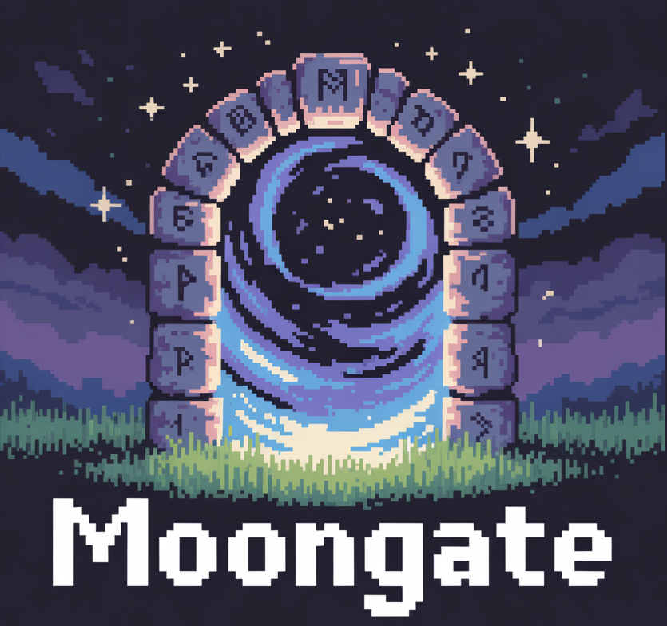
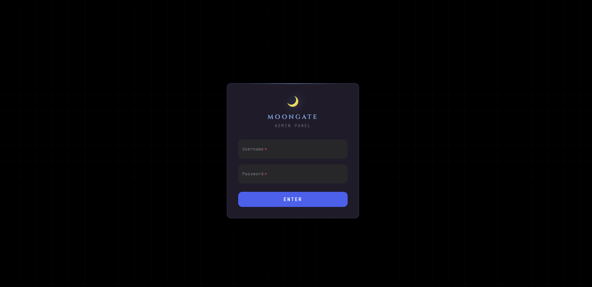
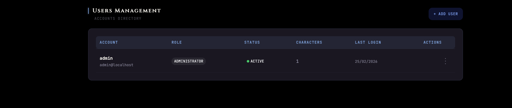
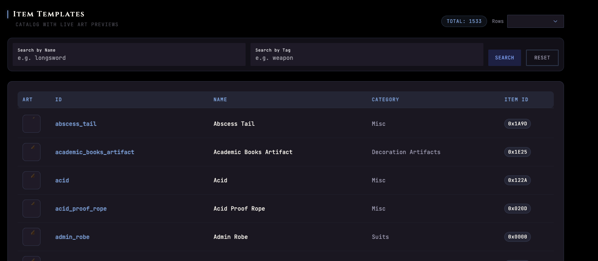
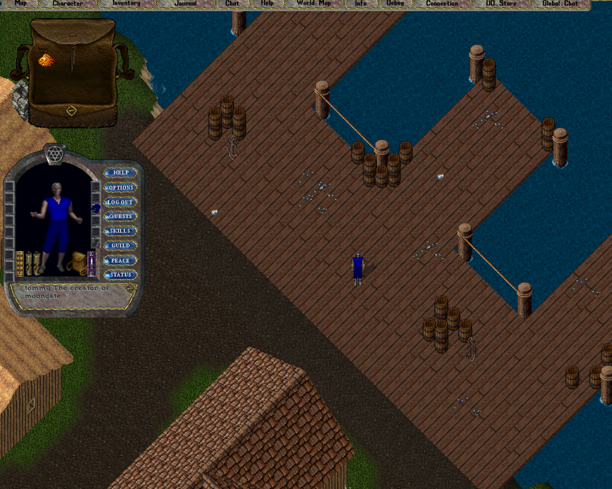
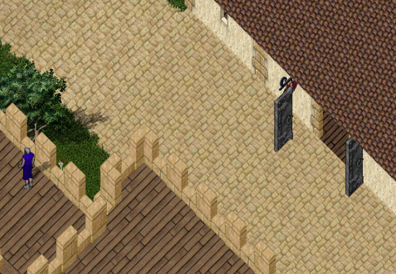
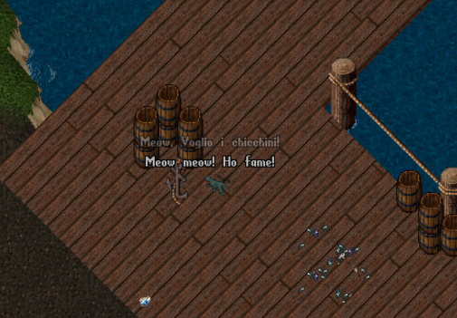
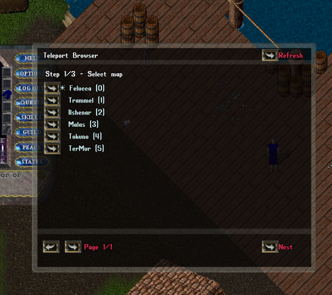

# Moongate v2

<p align="center">
  
</p>

<p align="center">
  
  
  
  
</p>

[](https://github.com/moongate-community/moongate/actions/workflows/ci.yml)
[](https://github.com/moongate-community/moongate/actions/workflows/ci.yml)
[](https://github.com/moongate-community/moongate/actions/workflows/coverage.yml)
[](https://app.fossa.com/projects/git%2Bgithub.com%2Fmoongate-community%2Fmoongate?ref=badge_small)
[](https://hub.docker.com/r/tgiachi/moongate)

Moongate v2 is a modern Ultima Online server built with .NET 10, NativeAOT support, deterministic game-loop processing, Lua scripting, and a chunk/sector-based spatial world model.

Latest dev log: <https://orivega.io/moongate-v2-dev-log-3-player-portal-maps-books-and-a-net-bug-i-didnt-own/> covers the last week of development.

## Looking for Collaborators

I am actively looking for contributors and reviewers.

- Issues: <https://github.com/moongate-community/moongate/issues>
- Discussions: <https://github.com/moongate-community/moongate/discussions>
- Matrix: <https://matrix.to/#/#moongate:matrix.org>

## Quick Start

### Requirements

- .NET SDK 10.0+
- Ultima Online data files (client)

### Run Server (local)

```bash
git clone https://github.com/moongate-community/moongate.git
cd moongate
dotnet run --project src/Moongate.Server -- --root-directory ~/moongate --uo-directory ~/uo
```

### Run Server (Docker quick start)

```bash
git clone https://github.com/moongate-community/moongate.git
cd moongate
docker build -t moongate:local .
docker run --rm -it \
  -p 2593:2593 \
  -p 8088:8088 \
  -v "$HOME/moongate:/app/moongate" \
  -v "$HOME/uo:/app/uo" \
  moongate:local
```

Server port: `2593`  
HTTP/UI API port: `8088`

Default credentials: `admin` / `password`  
Change them immediately from the server console with `.password`.

Player portal routes:

- Dev UI: `http://localhost:5173/portal/login`
- Embedded UI: `http://localhost:8088/portal/login`
- Authenticated profile: `http://localhost:8088/portal/profile`

### Run UI (dev)

```bash
cd ui
npm install
npm run dev
```

UI default URL: `http://localhost:8088/`

## What Is In Scope Today

- UO TCP server + packet pipeline
- Deterministic single game-loop with separate network inbound/outbound workers
- Source-generated packet/command/listener registration
- Sector/chunk spatial system with lazy warmup and broadcast radius
- Snapshot + journal persistence (MessagePack source-generated, AOT-safe)
- Lua scripting runtime for commands, gumps, item/mobile behavior
- Classic books rendered from `moongate_data/templates/books/*.txt`, with support for both read-only content and writable books (`0x93` header saves, `0x66` page saves)
- HTTP admin API + OpenAPI for tooling/UI
- Web admin UI (`ui/`) for item templates and server/admin workflows
- Player portal for authenticated account overview, profile editing, and password change (`/portal/login`, `/portal/profile`, `/api/portal/me`, `/api/portal/me/password`)

## Project Highlights

- Spatial model is sector-first (chunk-style), not pure repeated range scans.
- World generation pipeline uses named generators (`IWorldGenerator`) and command-triggered runs (example: doors).
- Doors support runtime open/close behavior and network updates.
- AOT stability issue in persistence was resolved by moving to MessagePack-CSharp source-generated contracts.
- Mobile domain model was refactored to remove `Level` and `Experience` from `UOMobileEntity` (they are not part of the base UO mobile model).

## Screenshots

### Web Admin UI

- **UI Screen 1**: login and initial admin entry point.
  
- **UI Screen 2**: authenticated dashboard and main navigation.
  
- **UI Screen 3**: item templates search with image previews.
  

### In-Game Features

- **Character Creator at Docks**: character creation flow and initial spawn area.
  
- **Door Open/Close Fix**: the bug is still there (damn doors).
  
- **Orion Lua Brain**: scripted NPC behavior example (`orion.lua`) with speech loop (my cat is always hungry and always looking for food).
  
- **Teleport Gump**: Lua-driven teleport UI and location workflow.
  

## Documentation

- Docs home: `docs/index.md`
- Getting started: `docs/articles/getting-started/`
- Architecture: `docs/articles/architecture/`
- Scripting: `docs/articles/scripting/`
- Persistence: `docs/articles/persistence/`
- Networking/protocol: `docs/articles/networking/`
- Operations/stress test: `docs/articles/operations/stress-test.md`

Published docs: <https://moongate-community.github.io/moongate/>

## Benchmarks and Stress

- Benchmarks project: `benchmarks/Moongate.Benchmarks`
- Cross-map teleport cold-destination benchmark: `TeleportMapChangeBenchmark.HandleCrossMapTeleport_ColdDestination`
- Same-map teleport cold-destination benchmark with self refresh: `TeleportMapChangeBenchmark.HandleSameMapTeleport_ColdDestination_WithSelfRefresh`
  - Dry run on Apple M4 Max / .NET 10:
    - cross-map median `2.696 ms`, mean `3.964 ms`, first cold outlier `17.800 ms`, allocated `1.77 MB`
    - same-map median `1.684 ms`, mean `2.536 ms`, first cold outlier `11.828 ms`, allocated `1.17 MB`
- Black-box socket stress tool: `tools/Moongate.Stress`
- Guide: `docs/articles/operations/stress-test.md`
- Packet handler performance guide: `docs/articles/networking/packet-handler-performance.md`

## Acknowledgements

Moongate v2 is inspired by the UO emulator ecosystem.

Special thanks:

- POLServer: <https://github.com/polserver/polserver>
- ModernUO: <https://github.com/modernuo/modernuo>

Data imported/adapted from ModernUO distribution is used in selected world datasets (decoration, locations, signs).

## Star History

[](https://www.star-history.com/?repos=moongate-community%2Fmoongate&type=date&legend=top-left)

## Contributing

Contributions are welcome. Please open an issue/discussion first for non-trivial changes.

- Follow `CODE_CONVENTION.md`
- Keep tests green
- Keep docs aligned with runtime behavior

## License

GPL-3.0. See `LICENSE`.
